# Análise de Vendas do Mercado Editorial
### Relatório de Projeto de Dados — Metodologia CRISP-DM

**Base de dados:** Books_Data_Clean.csv &nbsp;|&nbsp; 1.070 registros &nbsp;|&nbsp; 15 variáveis

---

## Sumário Executivo

Este relatório apresenta a análise exploratória e estatística de uma base de dados do mercado editorial, contendo informações sobre 1.070 livros, seus autores, editoras, avaliações, preços e volume de vendas. O objetivo foi identificar os fatores que mais se relacionam com o sucesso comercial de um livro (unidades vendidas e receita), avaliando variáveis como gênero, avaliação média, quantidade de avaliações, preço, reputação do autor e editora.

O trabalho foi conduzido seguindo a metodologia **CRISP-DM** (Cross Industry Standard Process for Data Mining), organizada em seis fases: Entendimento do Negócio, Entendimento dos Dados, Preparação dos Dados, Modelagem, Avaliação e Implantação.

> 💡 **Principais achados**
> - Não existe correlação forte entre a nota média de um livro e o quanto ele vende — a qualidade percebida não é o principal motor de vendas.
> - A quantidade de avaliações recebidas tem correlação moderada e positiva (0,49) com as vendas brutas: livros mais comentados vendem mais, independente da nota.
> - Preço não garante sucesso: livros muito baratos (abaixo de 5) são os únicos que atingem os patamares mais altos de unidades vendidas, mas a maioria dos livros baratos também vende pouco.
> - A reputação do autor (Famous, Excellent, Intermediate, Novice) não apresenta diferença estatisticamente significativa nas vendas (teste t, p = 0,51).
> - Ficção domina o volume de avaliações e de títulos, mas também é o gênero com opiniões mais polarizadas.
> - A Penguin Group (USA) LLC é a editora com maior receita total acumulada.

---

## 1. Entendimento do Negócio (Business Understanding)

A fase inicial do CRISP-DM define os objetivos do projeto sob a ótica do negócio. O conjunto de dados representa um catálogo de livros publicados, com métricas comerciais (vendas, receita, preço) e métricas de percepção do público (nota média, quantidade de avaliações).

### 1.1 Perguntas de negócio

- O que faz um livro vender mais: a nota que recebe, a quantidade de pessoas que avaliam, o preço ou o gênero?
- A reputação do autor (Famous, Excellent, Intermediate, Novice) influencia as vendas?
- Existe um gênero literário que se destaca em engajamento (volume de avaliações) e em aceitação (nota média)?
- Existe relação entre preço de venda e unidades vendidas?
- Quais editoras e autores concentram a maior receita?
- O ano de publicação influencia o volume histórico de vendas?

### 1.2 Critério de sucesso

O sucesso do projeto é medido pela capacidade de transformar os dados brutos em recomendações acionáveis para decisões editoriais e comerciais.

---

## 2. Entendimento dos Dados (Data Understanding)

### 2.1 Carregamento e primeira visualização

```python
import pandas as pd
import matplotlib.pyplot as plt
import seaborn as sns

df = pd.read_csv('Books_Data_Clean.csv')
df.head()
```

Confirma que a base contém colunas como `Book Name`, `Author`, `language_code`, `Author_Rating`, `Book_average_rating`, `Book_ratings_count`, `genre`, `gross sales`, `publisher revenue`, `sale price`, `sales rank`, `Publisher` e `units sold`.

### 2.2 Estrutura da base

```python
df.info()
```

1.070 linhas e 15 colunas: 5 variáveis float64, 4 int64 e 6 object.

### 2.3 Valores nulos

```python
df.isna().sum()
```

| Coluna | Valores nulos |
|---|---|
| Publishing Year | 1 |
| Book Name | 23 |
| language_code | 53 |
| Demais colunas | 0 |

> **Interpretação:** apenas 3 colunas possuem valores ausentes, em proporção baixa (no máximo ~5%). A estratégia mais segura é remover as linhas problemáticas em vez de imputar valores.

### 2.4 Estatísticas descritivas

```python
df.describe()
```

| Variável | Média | Mínimo | Máximo | Observação |
|---|---|---|---|---|
| Publishing Year | 1971,4 | **-560** | 2016 | Valor mínimo negativo é inconsistente |
| Book_average_rating | 4,01 | 2,97 | 4,77 | Notas concentradas próximas de 4 |
| Book_ratings_count | 94.910 | 27.308 | 206.792 | Alto volume de avaliações em todos os livros |
| gross sales | 1.856,6 | 104,9 | 47.795 | Forte assimetria (poucos vendem muito) |
| sale price | 4,87 | 0,99 | 33,86 | Maioria dos preços é baixa |
| units sold | 9.677 | 106 | 61.560 | Grande dispersão nas vendas |

> ⚠️ **Insight crítico:** o valor mínimo de `Publishing Year` é -560, o que não é um ano de publicação real. Esse é o principal problema de qualidade de dados identificado, tratado na fase de preparação.

---

## 3. Preparação dos Dados (Data Preparation)

### 3.1 Filtragem de anos inválidos

```python
df = df[df["Publishing Year"] >= 1900]
```

Elimina os registros com anos inconsistentes, mantendo livros publicados a partir de 1900.

### 3.2 Remoção de nomes de livro ausentes

```python
df = df[~df["Book Name"].isna()]
```

As 23 linhas sem nome de livro foram descartadas.

### 3.3 Verificação de duplicatas

```python
df.duplicated().sum()
```
Resultado: **0** — nenhuma linha duplicada encontrada.

### 3.4 Contagem de valores únicos

```python
df.nunique()
```
669 autores únicos, 9 editoras, 4 gêneros e 8 códigos de idioma.

### 3.5 Consolidação de categorias de gênero

A base trazia 4 categorias: 
`genre fiction` (759), 
`nonfiction` (160),   
`fiction` (54) e 
`children` (15).

```python
df['genre'] = df['genre'].apply(lambda genre: 'Ficção' if genre == "genre fiction" else genre)
```

> ⚠️ **Ponto de atenção técnico:** o código renomeia apenas `"genre fiction"` para `"Ficção"`, mas `"fiction"` (54 registros) permanece separado. A unificação pretendida não foi totalmente concluída. Recomenda-se ajustar para: `genre in ["genre fiction", "fiction"] → "Ficção"`.

---

## 4. Modelagem e Análise Exploratória (Modeling)

### 4.1 Distribuição de livros por ano de publicação

```python
plt.hist(df["Publishing Year"], bins=50)
plt.xlabel('Ano de Publicação'); plt.ylabel('Frequência')
plt.title('Distribuição de Livros por Ano de Publicação')
plt.show()
```
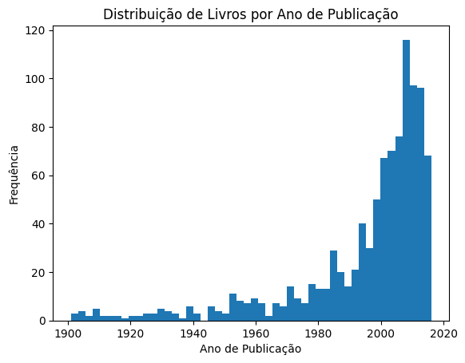


> 💡 Maior concentração de títulos entre o final do século XX e início dos anos 2000, com pico próximo a 2010-2012 — a base é majoritariamente composta por lançamentos recentes.

### 4.2 Distribuição por gênero

```python 
df["genre"].value_counts().plot(kind="bar")
```

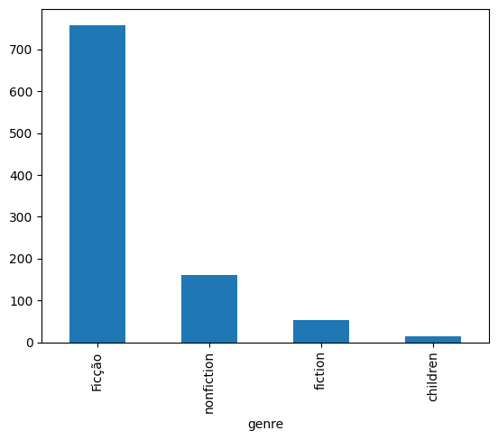

> 💡 Ficção é disparadamente o gênero mais representado. A base é enviesada para esse gênero.

### 4.3 Nota média por autor

```python
df.groupby("Author")["Book_average_rating"].mean().sort_values(ascending=False)
```

Bill Watterson (4,65), J.R.R. Tolkien (4,59) e George R.R. Martin (4,56) lideram; Sue Monk Kidd (3,10) aparece na extremidade inferior.

### 4.4 Volume de avaliações por gênero

```python
sns.boxplot(x="genre", y="Book_ratings_count", data=df)
plt.xlabel("Gênero")
```

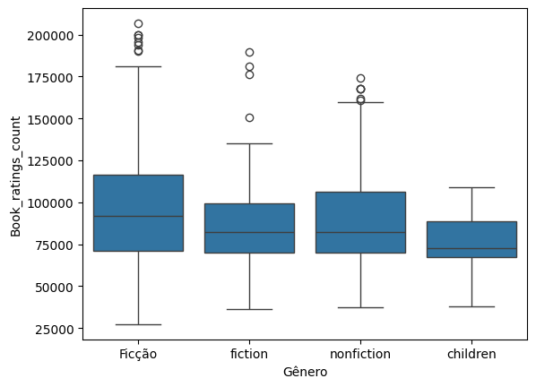

> 💡 **Insights:**
> - Ficção recebe o maior volume de avaliações.
> - Dentro de ficção, o quartil superior é bem mais disperso — alguns títulos se destacam muito mais que outros.
> - Children é o gênero mais estável, sem outliers de sucesso isolado.

### 4.5 Nota média por gênero

```python
sns.boxplot(x="genre", y="Book_average_rating", data=df)
plt.xlabel("Gênero")
```

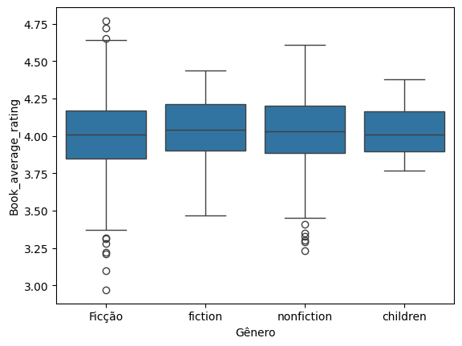

> 💡 **Insights:**
> - Medianas de nota giram em torno de 4,0 em todos os gêneros.
> - Nonfiction tem outliers apenas na parte inferior (livros muito mal avaliados).
> - Ficção tem as maiores amplitudes — reações mais polarizadas.
> - Children é o gênero mais consensual.

**Síntese:** Ficção move o maior volume de opiniões e gera reações mais extremas; Nonfiction tem público satisfeito na média mas pune notas baixas quando decepciona; Children tem baixo volume mas altíssima estabilidade.

### 4.6 Preço de venda x unidades vendidas

```python
plt.scatter(df["sale price"], df["units sold"])
plt.xlabel("Sale price"); plt.ylabel("Units sold")
```

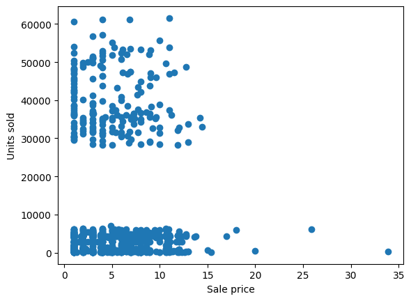

> 💡 **Insights:**
> - Divisão bimodal clara: livros vendem muito pouco ou muito, com um vazio na faixa intermediária.
> - Preço baixo (1 a 5) não garante vendas altas — mas todos os grandes sucessos estão nessa faixa.
> - Nenhum livro acima de 15 atinge o patamar de best-seller.

### 4.7 Distribuição por idioma

```python
language_counts = df["language_code"].value_counts()
plt.pie(language_counts, labels=language_counts.index)
```

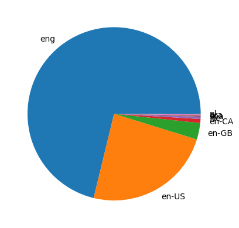

> 💡 O inglês domina quase totalmente a base (`eng` + `en-US` já são a maioria). Outros idiomas têm participação residual.

### 4.8 Receita por editora

```python
df.groupby("Publisher ")["publisher revenue"].sum().sort_values(ascending=False)
```

| Editora | Receita total (US$) |
|---|---|
| Penguin Group (USA) LLC | 191.581,10 |
| Random House LLC | 174.956,24 |
| Amazon Digital Services, Inc. | 141.767,77 |
| HarperCollins Publishers | 121.769,81 |
| Hachette Book Group | 107.410,97 |
| Simon and Schuster Digital Sales Inc | 46.858,21 |
| Macmillan | 31.249,83 |

> 💡 Penguin Group lidera, seguida de perto por Random House e Amazon Digital Services — reforçando a relevância da distribuição digital direta.

### 4.9 Reputação do autor: distribuição e engajamento

```python
df["Author_Rating"].value_counts()
```

| Reputação | Qtde. de livros | Soma de avaliações |
|---|---|---|
| Intermediate | 576 | 58.406.557 |
| Excellent | 336 | 28.158.413 |
| Famous | 48 | 4.718.172 |
| Novice | 28 | 2.444.917 |

> 💡 Autores "Famous" são minoria na base — qualquer comparação entre grupos precisa considerar esse desequilíbrio amostral.

### 4.10 Correlação entre nota e volume de avaliações

```python
plt.scatter(df["Book_average_rating"], df["Book_ratings_count"])
```

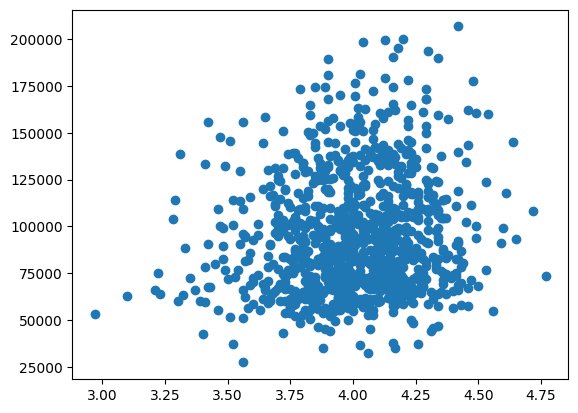

> 💡 Sem tendência linear clara. Notas muito altas ou muito baixas tendem a acumular mais avaliações do que notas "medianas" — padrão típico de avaliações online.

### 4.11 Nota média x unidades vendidas

```python
plt.scatter(df["Book_average_rating"], df["units sold"])
```

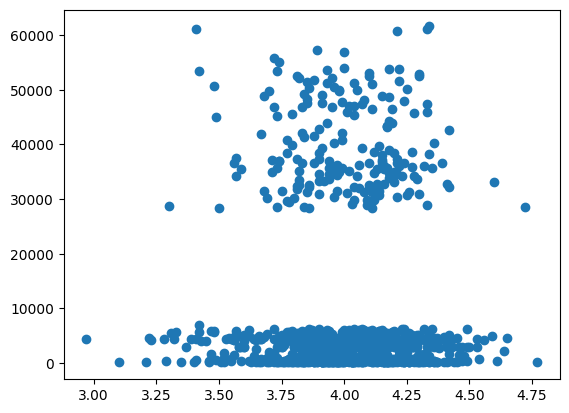

> 💡 Sem relação clara entre nota e volume de vendas.

### 4.12 Zoom na faixa de vendas abaixo de 10 mil unidades

```python
booleano = df["units sold"] < 10000
plt.scatter(df[booleano]["Book_average_rating"], df[booleano]["units sold"])
```

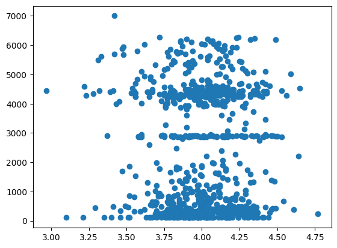

> 💡 Mesmo isolando a maioria dos livros, a nota não é preditor confiável de volume vendido.

### 4.13 Autores com maior venda bruta acumulada

```python
df.groupby("Author")["gross sales"].sum().sort_values(ascending=False)
```

Harper Lee (US$ 47.795,00), Stephen King (US$ 43.322,65), David Sedaris (US$ 42.323,41), Charlaine Harris (US$ 39.453,08) e Laini Taylor (US$ 38.278,41) lideram o ranking.

### 4.14 Matriz de correlação entre variáveis-chave

```python
df[["Book_average_rating", "Book_ratings_count", "gross sales", "sale price"]].corr()
```

| | Nota média | Qtd. avaliações | Vendas brutas | Preço |
|---|---|---|---|---|
| Nota média | 1,00 | 0,12 | -0,04 | -0,02 |
| Qtd. avaliações | 0,12 | 1,00 | **0,49** | -0,07 |
| Vendas brutas | -0,04 | **0,49** | 1,00 | 0,27 |
| Preço | -0,02 | -0,07 | 0,27 | 1,00 |

> 💡 **Insight principal:** a maior correlação da base é entre Quantidade de Avaliações e Vendas Brutas (0,49) — popularidade importa mais para o resultado comercial do que a nota em si (correlação praticamente nula, -0,04).

### 4.15 Reputação do autor x unidades vendidas

```python
sns.boxplot(x="Author_Rating", y="units sold", data=df)
```

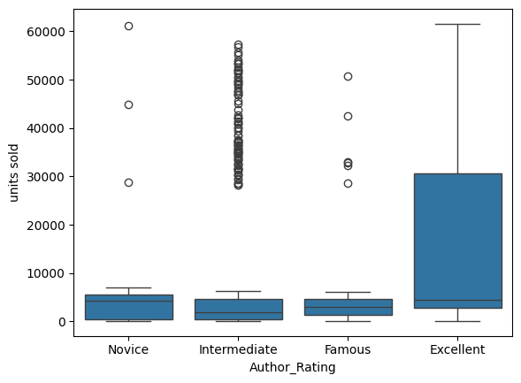

> 💡 As caixas dos quatro grupos se sobrepõem consideravelmente, sem destaque visual de nenhum grupo.

### 4.16 Unidades vendidas ao longo dos anos de publicação

```python
df.groupby("Publishing Year")["units sold"].sum().plot(kind="line", marker="o")
```

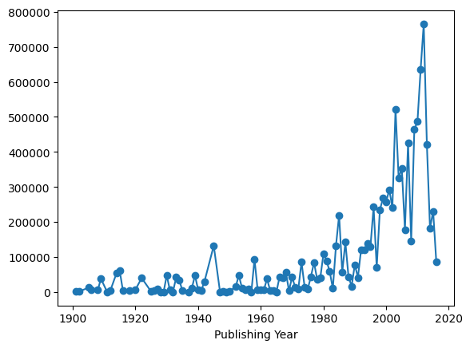

> 💡 Volume irregular, com picos isolados em vez de tendência suave — sucesso associado a títulos específicos, não a uma tendência de mercado.

### 4.17 Teste estatístico: reputação "Famous" x "Intermediate"

```python
import scipy.stats as stats

grupo_A = df[df['Author_Rating'] == 'Famous']['units sold']
grupo_B = df[df['Author_Rating'] == 'Intermediate']['units sold']

t_stats, p_val = stats.ttest_ind(grupo_A, grupo_B, equal_var=False)
print(f"Estatística t: {t_stats:.4f}")
print(f"Valor p: {p_val:.4f}")
```

**Resultado:** Estatística t = -0,6595 &nbsp;|&nbsp; Valor p = 0,5121

> 💡 **Interpretação:** como p (0,5121) é muito maior que 0,05, não há evidência estatística de diferença real entre as vendas de autores "Famous" e "Intermediate". Ser mais famoso não garante, por si só, vender mais.

---

## 5. Avaliação dos Resultados (Evaluation)

### 5.1 Perguntas de negócio respondidas

| Pergunta de negócio | Resposta encontrada |
|---|---|
| O que faz um livro vender mais? | Volume de avaliações tem relação moderada; nota e preço isoladamente têm relação fraca/nula |
| Reputação do autor influencia vendas? | Não, estatisticamente (teste t, p=0,51) |
| Existe gênero de destaque? | Ficção lidera em volume e polarização; Children é o mais consensual |
| Preço x vendas? | Sem relação direta; preço baixo é necessário mas não suficiente para vendas altas |
| Editoras/autores líderes? | Penguin Group (USA) LLC lidera receita; Harper Lee lidera vendas brutas |
| Ano de publicação influencia vendas históricas? | Sem tendência temporal clara |

### 5.2 Limitações identificadas

- Desequilíbrio amostral entre grupos de reputação do autor.
- Base enviesada para idioma inglês e gênero ficção.
- Categoria "fiction" não totalmente unificada com "Ficção".
- Análise correlacional/descritiva, sem modelo preditivo formal.
- Outlier de ano de publicação (-560) removido, mas reforça necessidade de validação de qualidade dos dados.

---

## 6. Implantação e Recomendações (Deployment)

### 6.1 Recomendações de negócio

- Investir em ações que aumentem o engajamento/volume de avaliações (marketing, parcerias, campanhas de review).
- Não basear decisões editoriais apenas na reputação prévia do autor.
- Definir preços abaixo de 15 para títulos com potencial de best-seller.
- Priorizar Ficção para maximizar alcance, preparando-se para reações polarizadas.
- Observar o peso da distribuição digital (Amazon Digital Services) na receita.

### 6.2 Próximos passos sugeridos

- Construir modelo preditivo (regressão múltipla, árvore de decisão) combinando múltiplas variáveis.
- Corrigir a unificação da categoria de gênero "fiction"/"Ficção".
- Buscar dados complementares para equilibrar a amostra por reputação do autor.
- Investigar os "fenômenos de sucesso" (outliers) identificados nos boxplots.

---

## 7. Conclusão Geral

A análise indica que o sucesso comercial de um livro, nesta base, está muito mais associado à sua popularidade e volume de engajamento do público (quantidade de avaliações) do que à qualidade percebida (nota média) ou à reputação prévia do autor. Preço tem papel de "restrição" — livros caros dificilmente se tornam best-sellers — mas não é, isoladamente, garantia de alto volume de vendas. Essas conclusões devem ser lidas com cautela dado o viés de idioma e gênero presente na base, e podem orientar decisões editoriais e de marketing voltadas a maximizar o engajamento do público.
